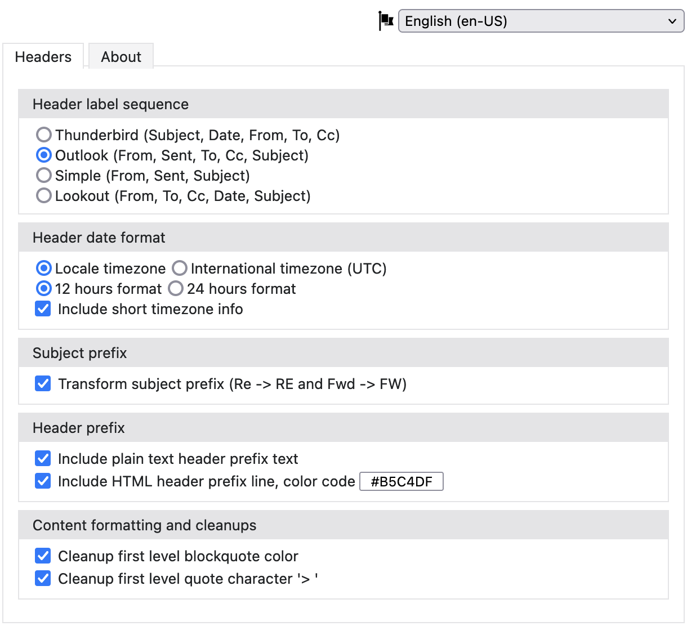

 

 <h1 align="center">ReplyWithHeader (RWH)</h1>
 
Outlook style headers and few goodies for Thunderbird

   

## Download
Head to Thunderbord Add-ons store to download. **RWH v3 is completly rewritten from ground up in {Web|Mail}Extension model**

<b><a href="https://addons.thunderbird.net/en-US/thunderbird/addon/replywithheader/" alt="">Thunderbird Add-ons Store</a></b>

## Features
ReplyWithHeader (RWH) is an Thunderbird email client add-on, that brings outlook style headers and few goodies into Thunderbird.

 

## Support & Donate

* Write reviews and give Stars on [Thunderbird Add-ons Store](https://addons.thunderbird.net/en-US/thunderbird/addon/replywithheader/)
* Donate via [PayPal](https://www.paypal.com/donate/?cmd=_donations&business=QWMZG74FW4QYC&lc=US&item_name=ReplyWithHeader+(RWH)+Thunderbird+Addon&currency_code=USD)

## Report Issues

ReplyWithHeaderMozilla uses [GitHub’s integrated issue tracking system](https://github.com/jeevatkm/ReplyWithHeaderMozilla/issues) to record bugs and feature requests. If you want to raise an issue, please follow the recommendations bellow:

  * Before you log a bug, please search the issue tracker to see if someone has already reported the problem. If the issue doesn’t already exist, create a new issue.
  * Please provide as much information as possible with the issue report, we like to know the version of ReplyWithHeader that you are using.
  * If you need to paste code, or include a stack trace use Markdown code block

## Creator

[Jeevanandam M.](https://github.com/jeevatkm) (jeeva@myjeeva.com)

## Contributors

Have a look on [Contributors](https://github.com/jeevatkm/ReplyWithHeaderMozilla/graphs/contributors) page.

## License

ReplyWithHeader Mozilla is released under [MPL-2.0 License](LICENSE)
